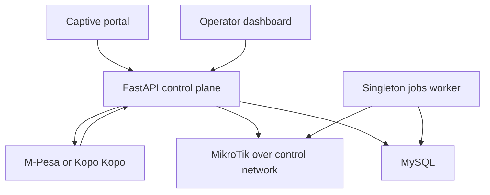

# Uzanet ISP control plane

FastAPI backend for a multi-router ISP MVP supporting MikroTik Hotspot and PPPoE customers, router-scoped plans, M-Pesa/Kopo Kopo payments, and safe router onboarding.

## What is included

- JWT operator and superadmin authentication with lockout, `/me`, logout revocation, and tenant-safe router ownership.
- Stable public UUIDs/slugs; database IDs and router credentials are never public API identifiers.
- Encrypted RouterOS and PPPoE credentials at rest.
- Authenticated, timeout-bounded RouterOS health checks and idempotent Hotspot/PPPoE provisioning.
- Server-priced, portal-scoped payment sessions with idempotency keys, rate limiting, protected polling, callback validation, and retryable provisioning.
- Direct Safaricom Daraja STK Push and Kopo Kopo incoming-payment adapters.
- A singleton jobs worker for expired access and payment reconciliation.
- One-time RouterOS onboarding bundles that back up first, preserve WAN/default routes/DNS, and manage only objects marked `uzanet-managed`.



## Local start

1. Copy `.env.example` to `.env` and replace every placeholder.
2. Generate values with `openssl rand -hex 32` for `SECRET_KEY` and `python -c "from cryptography.fernet import Fernet; print(Fernet.generate_key().decode())"` for `ROUTER_CREDENTIAL_KEY`.
3. Start both the API and singleton jobs worker:

```bash
docker compose up --build
```

The API listens on `http://localhost:8083`; readiness is `/health/ready` and liveness is `/health/live`.

For a non-container development loop:

```bash
python -m venv .venv
. .venv/bin/activate
pip install -r requirements.txt -r requirements-dev.txt
alembic upgrade head
uvicorn mono:app --reload
```

## Production deployment

Deploy the API and exactly one `python jobs.py` process. Put the API behind an HTTPS reverse proxy, allow only the configured frontend in `CORS_ORIGINS`, and set explicit `ALLOWED_HOSTS`. Run `alembic upgrade head` only after a verified database backup.

Production startup rejects weak/missing secrets, wildcard CORS/hosts, HTTP provider URLs, an invalid Fernet key, an incomplete enabled payment provider, or disabled M-Pesa callback verification. Enable providers with `PAYMENT_PROVIDERS=mpesa,kopokopo`; each router can select only an enabled provider.

Register these exact public callback URLs with the provider:

- `https://<api-host>/api/v1/webhooks/mpesa/stk`
- `https://<api-host>/api/v1/webhooks/kopokopo/incoming-payment`

Keep API documentation disabled in production unless operators need it: `ENABLE_API_DOCS=false`.

## Router onboarding

1. The operator creates an onboarding bundle in the dashboard.
2. Provision the returned L2TP username/password on the VPN server or RADIUS control plane.
3. Import the returned `.rsc` file before its claim token expires.
4. Confirm the router changes to `claimed`, then run an authenticated status check.
5. Create RouterOS profiles matching each Uzanet plan's `router_profile` before selling that plan.

The compatibility profile deliberately uses L2TP/PAP without IPsec, as required for legacy RouterOS support. It must therefore terminate inside a protected management underlay with strict source ACLs; never expose RouterOS API port 8728 to the public Internet. IPsec or WireGuard should be the next transport upgrade for capable routers.

The API generates but does not install the matching L2TP peer on an external VPN/RADIUS server. Automating that peer lifecycle is a deployment integration, not an API-side assumption.

## Payment lifecycle

`created → pending → provisioning → provisioned` is the success path. Terminal/attention states are `failed`, `manual_review`, and `provisioning_failed`. A provider callback never trusts a browser amount: router, package, service, amount, and profile come from the server-side payment session.

M-Pesa successful callbacks are queried against Daraja before provisioning in production. Kopo Kopo callbacks require an HMAC-SHA256 signature over the raw request body. Provisioning runs under a database row lock and reuses deterministic access identities so retries do not create duplicate users.

## Verification

```bash
pytest -q
python -m compileall -q .
```

Live launch still requires sandbox and production-provider callback tests, a real RouterOS 6/7 smoke test, restore testing, and control-network/VPN validation. See [SECURITY.md](SECURITY.md) before any deployment.
