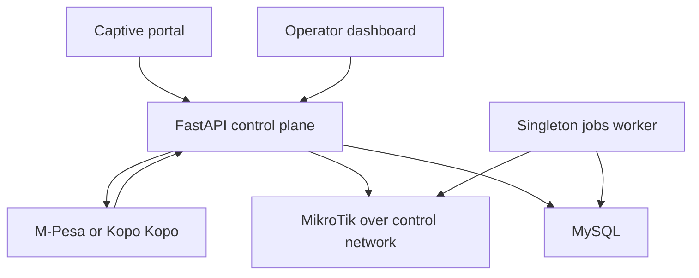

# Uzanet ISP control plane

FastAPI backend for a multi-router ISP MVP supporting MikroTik Hotspot and PPPoE customers, router-scoped plans, M-Pesa/Kopo Kopo payments, and safe router onboarding.

## What is included

- JWT operator and superadmin authentication with lockout, `/me`, logout revocation, and tenant-safe router ownership.
- Stable public UUIDs/slugs; database IDs and router credentials are never public API identifiers.
- Encrypted RouterOS and PPPoE credentials at rest.
- Authenticated, timeout-bounded RouterOS health checks and idempotent Hotspot/PPPoE provisioning.
- Server-priced, portal-scoped payment sessions with idempotency keys, rate limiting, protected polling, callback validation, and retryable provisioning.
- Direct Safaricom Daraja STK Push and Kopo Kopo incoming-payment adapters.
- A singleton jobs worker for expired access and payment reconciliation.
- Scoped RouterOS onboarding bundles that back up first, preserve WAN/default routes/DNS, and manage only objects marked `uzanet-managed`.



## Local start

1. Copy `.env.example` to `.env` and replace every placeholder.
2. Generate values with `openssl rand -hex 32` for `SECRET_KEY` and `python -c "from cryptography.fernet import Fernet; print(Fernet.generate_key().decode())"` for `ROUTER_CREDENTIAL_KEY`.
3. Start both the API and singleton jobs worker:

```bash
docker compose up --build
```

The API listens on `http://localhost:8083`; readiness is `/health/ready` and liveness is `/health/live`.

For a non-container development loop:

```bash
python -m venv .venv
. .venv/bin/activate
pip install -r requirements.txt -r requirements-dev.txt
alembic upgrade head
uvicorn mono:app --reload
```

## Production deployment

Deploy the API and exactly one `python jobs.py` process. Put the API behind an HTTPS reverse proxy, allow only the configured frontend in `CORS_ORIGINS`, and set explicit `ALLOWED_HOSTS`. Run `alembic upgrade head` only after a verified database backup.

Production startup rejects weak/missing secrets, wildcard CORS/hosts, HTTP provider URLs, an invalid Fernet key, an incomplete enabled payment provider, or disabled M-Pesa callback verification. Enable providers with `PAYMENT_PROVIDERS=mpesa,kopokopo`; each router can select only an enabled provider.

Register these exact public callback URLs with the provider:

- `https://<api-host>/api/v1/webhooks/mpesa/stk`
- `https://<api-host>/api/v1/webhooks/kopokopo/incoming-payment`

Keep API documentation disabled in production unless operators need it: `ENABLE_API_DOCS=false`.

## Router onboarding

1. The operator creates an onboarding bundle in the dashboard.
2. The host provisioning agent creates the matching `chap-secrets` peer and reserves its tunnel address.
3. Import the returned `.rsc` file before its claim token expires.
4. Confirm the router changes to `claimed`, then run an authenticated status check.
5. Create RouterOS profiles matching each Uzanet plan's `router_profile` before selling that plan.

The broad compatibility profile uses L2TP with CHAP, the RouterOS `default` PPP profile, and no IPsec to match the deployed `xl2tpd`/PPPd concentrator and low-resource RouterBOARDs. This is an authenticated management tunnel, not an encrypted transport: terminate it inside a protected management underlay with strict source ACLs and never expose RouterOS API port 8728 to the public Internet. IPsec or WireGuard should be the next transport upgrade for capable routers.

### Connect Coolify to xl2tpd on the same VPS

Install the small root-owned provisioning agent once on the VPS from a backend checkout:

```bash
sudo bash vpn_agent/install.sh
```

Copy the generated value into the Coolify application as `VPN_AGENT_SHARED_SECRET`. Keep `VPN_AGENT_SOCKET=/run/uzanet-vpn-agent/agent.sock`, ensure the Compose bind mount for `/run/uzanet-vpn-agent` is present, and redeploy the application. The backend then creates and removes its own `router-<uuid>` peers automatically. Communication stays on a signed Unix socket; there is no public agent port.

The installer matches the deployed pool (`10.10.10.10-10.10.10.100`), preserves non-Uzanet entries in `/etc/ppp/chap-secrets`, retains the latest 20 backups in `/var/lib/uzanet-vpn-agent/backups`, and exposes the socket to the container's numeric group `10001`. If the Coolify container UID/GID changes, update `UZANET_AGENT_SOCKET_GID` in `/etc/uzanet-vpn-agent/agent.env` before restarting the agent.

```bash
sudo systemctl restart uzanet-vpn-agent
sudo systemctl status uzanet-vpn-agent --no-pager
```

## Payment lifecycle

`created → pending → provisioning → provisioned` is the success path. Terminal/attention states are `failed`, `manual_review`, and `provisioning_failed`. A provider callback never trusts a browser amount: router, package, service, amount, and profile come from the server-side payment session.

M-Pesa successful callbacks are queried against Daraja before provisioning in production. Kopo Kopo callbacks require an HMAC-SHA256 signature over the raw request body. Provisioning runs under a database row lock and reuses deterministic access identities so retries do not create duplicate users.

## Verification

```bash
pytest -q
python -m compileall -q .
```

Live launch still requires sandbox and production-provider callback tests, a real RouterOS 6/7 smoke test, restore testing, and control-network/VPN validation. See [SECURITY.md](SECURITY.md) before any deployment.

### Paste-to-connect router onboarding

Deploy the backend first (`alembic upgrade head`, also run by the container entrypoint),
then the web portals/mobile companion. Configure `API_PUBLIC_URL` as the exact HTTPS
API origin, `ROUTER_CONTROL_HOST` as the reachable L2TP server, and the VPN agent as
above. No Netlify storage or public static RSC directory is needed.

Authenticated `POST /api/v1/routers/onboarding` returns `install_command`,
`download_url`, `tls_preflight_command`, and `legacy_ca_common_name` alongside the
existing `script`, `expires_at` and peer fields. The TLS preflight targets
`/health/live` and should succeed with `check-certificate=yes` before onboarding.
Older RouterOS 6 devices may need `ISRG Root X1` imported and marked trusted first;
use the actual file path reported by `/file print` (for example
`hotspot/isrgrootx1.pem`) rather than assuming a root filesystem path. Never disable
certificate validation to work around an old trust store.

Paste the entire install command into the intended RouterOS terminal. It removes a
stale file of the same generated name, fetches using a separate random
`X-Onboarding-Token` header, and imports only after fetch succeeds. TLS certificate
verification remains mandatory. A successfully imported RSC is deleted; if import
fails, the freshly downloaded RSC is deliberately kept so the operator can inspect
or retry it. A later install-command retry first removes that stale copy so a failed
fetch can never import an old script.

`GET /api/v1/router-onboarding/{router_uid}/script` uses the scoped download token but
is retryable while the router is still `pending` and the onboarding window remains
valid. Missing/wrong/expired tokens and unavailable routers return the same 404.
Tokens stay out of URLs; do not enable request header/body logging at the proxy. The
payload is encrypted at rest and erased on successful claim or expiry. Responses are
`no-store`. The independent claim token is still needed to register the assigned
tunnel address; downloading does not imply a working router connection.

The default onboarding window is 120 minutes (`ONBOARDING_TOKEN_MINUTES=120`) to
allow field setup and older RouterBOARD retries without turning a transient HTTP or
filesystem failure into a new router record. Operators may configure a different
window. Do not create another router/payment history merely to retry an import.
Existing clients can continue using the returned inline script during a rolling
deployment; the new response fields are additive.

By default the script refuses an existing `uzanet-control` tunnel with another
peer username. Explicit `replace_managed_tunnel: true` allows switching that
UzaNet-marked tunnel to the new peer; this disconnects the previous router record.
Unmarked name conflicts always stop. WAN/default routes, unrelated tunnels and
hotspot HTML are preserved. The per-onboarding configuration backup is not
overwritten on retry. Existing plans/customers/history are not migrated between
records. Captive portal redirects remain a separate configuration step.

RouterOS 6.49 compatibility: the generated RSC avoids `:break`, uses the deployed
CHAP-compatible L2TP settings (`profile=default allow=chap use-ipsec=no`), and uses
only `/tool fetch` options shared by RouterOS 6 and 7. The Uzanet onboarding endpoints
do not require redirects, so the generator deliberately does not emit the newer
`http-max-redirect-count` option. Certificate validation remains enabled. Network
errors never trigger a second fetch or automatic claim retry. This is generated
server-side, so portal/mobile clients receive the compatibility fix without a separate
UI update. Already-issued RSC bundles remain immutable; the fix applies to newly
generated bundles.

The setup command remains a compact single line. The download token stays in a
header, not the URL. No public bootstrap endpoint is added, and existing web/mobile
clients can continue displaying the server-generated command unchanged.
